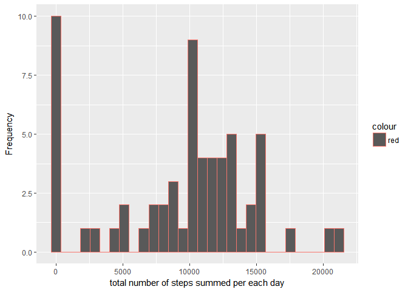
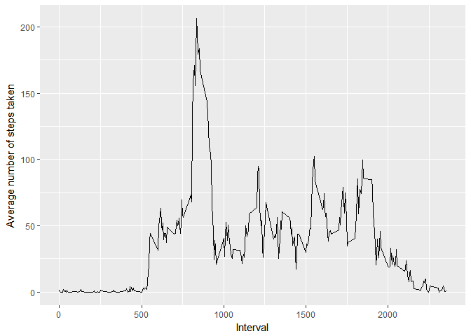
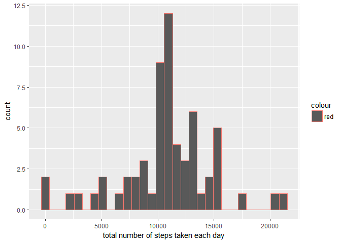
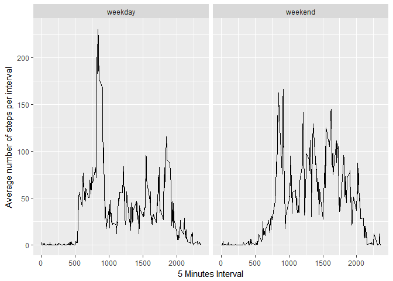

# Reproducible Research: Peer Assessment 1
## Loading and preprocessing the data

```r
        #reading the data
        setwd("C:/Users/rofaida.goda/RAweek2")
        unzip("activity.zip")
        activity = read.csv("activity.csv")
```

## What is mean total number of steps taken per day?
In this question, I will group the data by date, then sum the steps in each date. keeping into consideration removing the NAs.

```r
library(dplyr)
```

```
## Warning: package 'dplyr' was built under R version 3.3.3
```

```
## 
## Attaching package: 'dplyr'
```

```
## The following objects are masked from 'package:stats':
## 
##     filter, lag
```

```
## The following objects are masked from 'package:base':
## 
##     intersect, setdiff, setequal, union
```

```r
        sumbysteps = activity %>% group_by(date)%>%summarise(sumsteps =sum(steps,na.rm =TRUE ))
        #making histogram
library(ggplot2)
```

```
## Warning: package 'ggplot2' was built under R version 3.3.3
```

```r
        qplot(sumsteps, data = sumbysteps, colour = "red",xlab = "total number of steps summed per each day", ylab = "Frequency")
```

```
## `stat_bin()` using `bins = 30`. Pick better value with `binwidth`.
```

<!-- -->


The figure demonstrate the histogram for the frequency of total number of steps summed per each day


```r
avg = mean (sumbysteps$sumsteps)
```
Mean of the total number of steps taken per day is 9354.2295082


```r
med  = median (sumbysteps$sumsteps)
```

Median of the total number of steps taken per day is 10395


## What is the average daily activity pattern?


```r
byinterval = activity %>% group_by(interval) %>% summarize(avg = mean(steps, na.rm = TRUE ))

qplot(byinterval$interval, byinterval$avg, geom = "line", xlab = "Interval", ylab = "Average number of steps taken")
```

<!-- -->

```r
max5min = byinterval[ which.max(byinterval$avg),1]
```
The 5 minutes which contains the maximum number of steps is 835

## Imputing missing values

```r
missingrows = sum(! complete.cases(activity))
```
total number of missing values in the dataset = 2304


```r
avgbyinterval = activity %>% group_by (interval) %>% summarize(avg = mean(steps, na.rm = TRUE))
NArecords = activity[is.na(activity$steps),]

for (i in 1: nrow(activity) )
{
        if (is.na(activity$steps[i]))
        {activity[i,1] =                                                 avgbyinterval[avgbyinterval$interval==activity$interval[i],2]

        }
        
sumbydate = activity %>% group_by (date) %>% summarize(total = sum(steps, na.rm = TRUE))
}
library("ggplot2")
qplot(total, data = sumbydate, colour = "red",xlab = "total number of steps taken each day")
```

```
## `stat_bin()` using `bins = 30`. Pick better value with `binwidth`.
```

<!-- -->


```r
avg = mean (sumbydate$total)
```
Mean of the total number of steps per day is 1.0766189\times 10^{4}


```r
med  = median (sumbydate$total)
```
Median of the total number of steps per day is 1.0766189\times 10^{4}


## Are there differences in activity patterns between weekdays and weekends?

```r
        library("dplyr")

weekday.or.weekend <- function(date) {
    day <- weekdays(date)
    if (day %in% c("Monday", "Tuesday", "Wednesday", "Thursday", "Friday")) 
        return("weekday") else if (day %in% c("Saturday", "Sunday")) 
        return("weekend") else stop("invalid date")
}
activity$date <- as.Date(activity$date)
activity$day <- sapply(activity$date, FUN = weekday.or.weekend)

byweekday = activity %>% group_by(interval, day) %>% summarize(avg = mean(steps))
qplot(data = byweekday, interval, avg, facets = .~ day, geom = "line", ylab = "Average number of steps per interval" , xlab= "5 Minutes Interval")
```

<!-- -->

